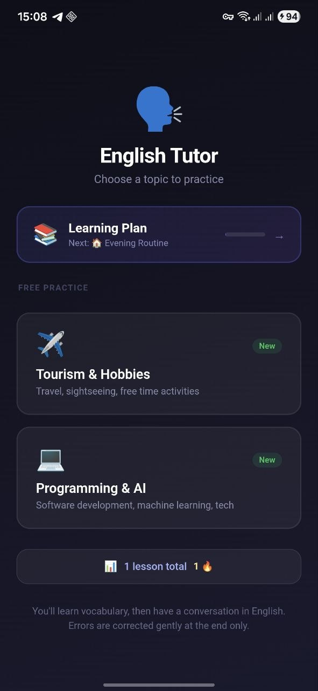
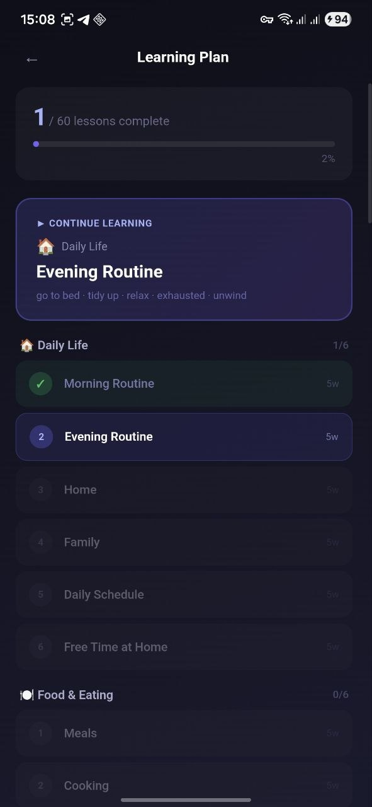
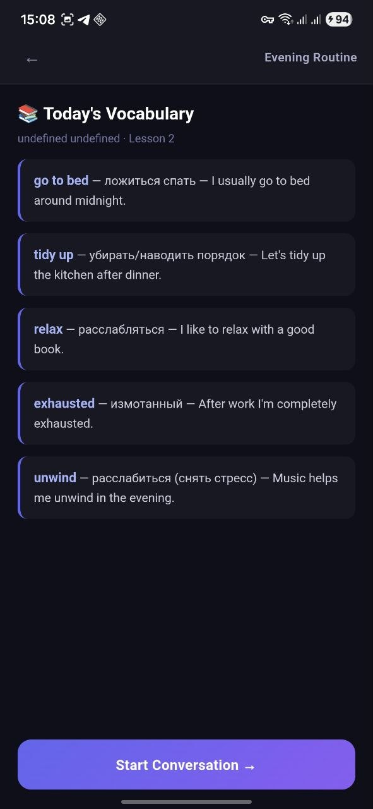
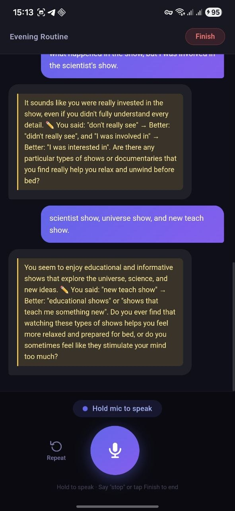
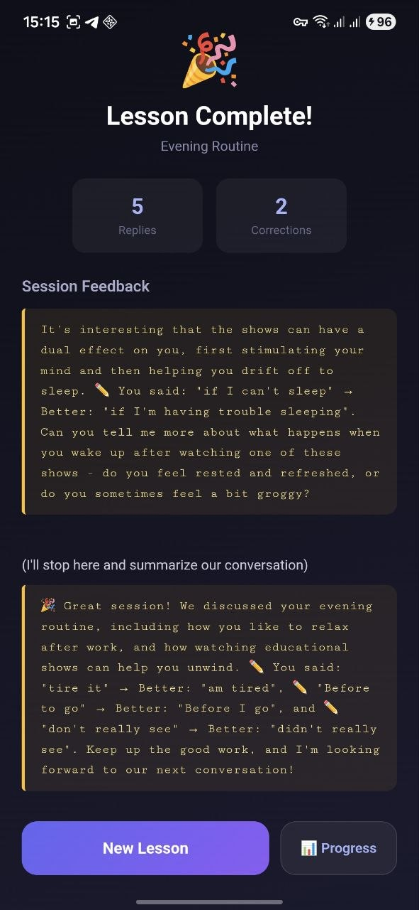
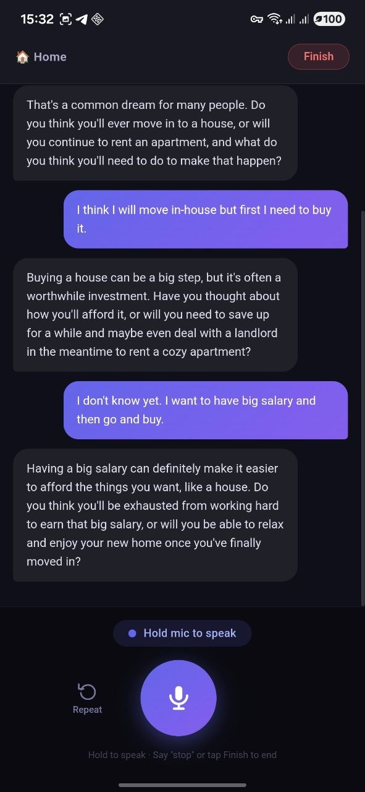

# 🗣️ English Tutor — AI Conversation App

A mobile English learning app for Android built with React + Capacitor. Practice real English conversations with an AI tutor that listens to your voice, corrects your mistakes, and remembers your progress.

---

## Screenshots

<p align="center">
  
  
  
  
  
  
</p>

---

## Features

- **Voice conversation** — hold the mic button to speak, release to send; AI responds with voice
- **AI corrections** — major grammar errors are corrected gently during the lesson
- **3-month curriculum** — 10 units × 6 lessons × 5 words = 300 B1–B2 vocabulary words with spaced repetition
- **Free practice** — open-ended conversation on any topic without a fixed curriculum
- **Progress tracking** — session history, streak counter, corrections to review
- **Memory** — AI remembers what you discussed in the previous session on the same topic

---

## Tech stack

| Layer | Technology |
|---|---|
| UI | React 18 + Vite |
| Mobile | Capacitor 7 (Android) |
| AI chat | Groq API — Llama 3.3 70B |
| Speech-to-text | Groq Whisper via MediaRecorder Web API |
| Text-to-speech | `@capacitor-community/text-to-speech` |
| Storage | localStorage |

---

## Prerequisites

Before you start, install:

1. **Node.js 18+** — [nodejs.org](https://nodejs.org)
2. **Android Studio** — [developer.android.com/studio](https://developer.android.com/studio)
   - During setup, install **Android SDK** (API 33+) and an emulator if needed
3. **Java** — comes bundled with Android Studio (no separate install needed)
4. **Groq API key** — free at [console.groq.com](https://console.groq.com)

---

## Setup

### 1. Clone and install dependencies

```bash
git clone https://github.com/nebula387/english-tutor.git
cd english-tutor
npm install
```

### 2. Create `.env` file

Create a file named `.env` in the project root:

```
VITE_GROQ_API_KEY=your_groq_api_key_here
```

### 3. Set JAVA_HOME (Windows)

Open PowerShell and run once:

```powershell
[System.Environment]::SetEnvironmentVariable(
  "JAVA_HOME",
  "C:\Program Files\Android\Android Studio\jbr",
  "User"
)
```

Restart your terminal after this.

---

## Build & install on Android phone

### Option A — automated script (recommended)

Connect your phone via USB with **USB Debugging enabled**, then run:

```powershell
.\build-and-install.ps1
```

This will build the web app, sync to Android, compile the APK, and install it on your phone automatically.

### Option B — manual steps

```powershell
# 1. Build web assets
npx vite build

# 2. Sync to Android
npx cap sync android

# 3. Build APK
cd android
.\gradlew assembleDebug
cd ..

# 4. Install on connected phone
adb install -r android\app\build\outputs\apk\debug\app-debug.apk
```

The APK file is at: `android/app/build/outputs/apk/debug/app-debug.apk`

---

## Enable USB Debugging on your phone

1. Go to **Settings → About phone**
2. Tap **Build number** 7 times until developer mode activates
3. Go to **Settings → Developer options**
4. Enable **USB Debugging**
5. Connect phone via USB and tap **Allow** when prompted on the phone

---

## Development (browser)

```bash
npm run dev
```

Opens at `http://localhost:5173`. Voice recording works in Chrome/Edge (hold mic button). Text-to-speech requires Android.

---

## Project structure

```
src/
  screens/
    TopicSelect.jsx   # Home screen — topic picker + plan entry
    PlanSelect.jsx    # 3-month curriculum overview
    Lesson.jsx        # Vocabulary + conversation screen
    Summary.jsx       # Post-lesson feedback
    Progress.jsx      # Stats and history
  services/
    groqService.js        # Groq API — chat + Whisper transcription
    speechService.js      # MediaRecorder + Web Speech API + TTS
    curriculumService.js  # 60-lesson curriculum + progress
    progressService.js    # Session history (localStorage)
  components/
    VoiceButton.jsx   # Hold-to-speak mic button
    VocabBlock.jsx    # Vocabulary card list
    ChatMessage.jsx   # Chat bubble
```
